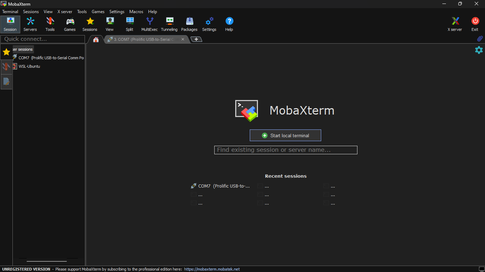
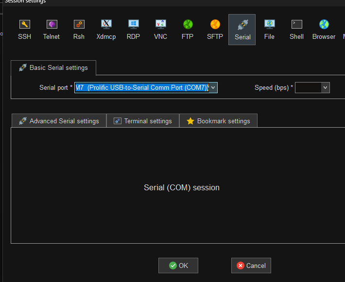

# Commands Book

The Commands Book is a comprehensive guide that provides step-by-step instructions for various operations and tasks. This book is particularly useful for those who are new to these commands or those who need a quick reference. The current edition includes detailed procedures for renaming a router using MobaXterm, complete with screenshots and commands. Each step is clearly explained, making it easy for users to follow along.

## Table of Contents

1. [Rename Router](#rename-router)
2. [Script Router Config](config_router.zsh)
3. [Script Lab VLAN](./vlan/LabVLAN.md)

## Rename Router

### Step 1

First open [MobaXterm](https://mobaxterm.mobatek.net/download.html) and click session

**Image:**



### Step 2

Click serial and select serial port **COM**

**Image:**



### Step 3

Write ***no*** to first question

**Image:**


### Step 4

Test if we have a configuration file saved

**Command:**

```bash
show startup-config
```

**Image:**


### Step 5

Write command

**Command:**

```bash
enable
```

**Image:**


### Step 6

Change name

**Command:**

```bash
conf terminal
hostname {{your name}}
```

**Image:**


### Step 7

write command

**Command:**

```bash
exit
```

**Image:**


### Step 8

write command to save configuration

**Command:**

```bash
copy running-config startup-config
```

**Image:**


> [!NOTE]  
> to view file running or startup you can use `show running-config`
